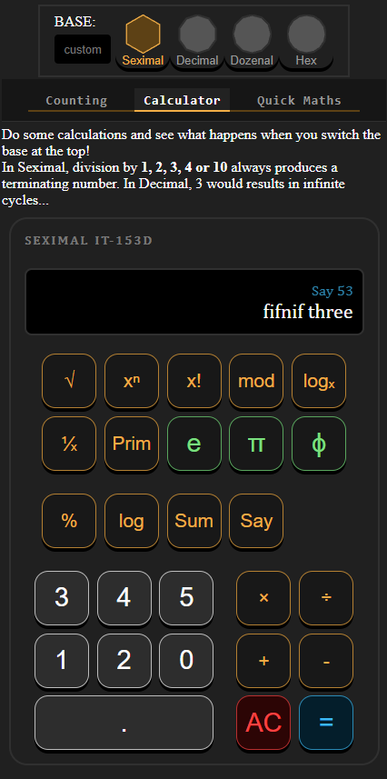
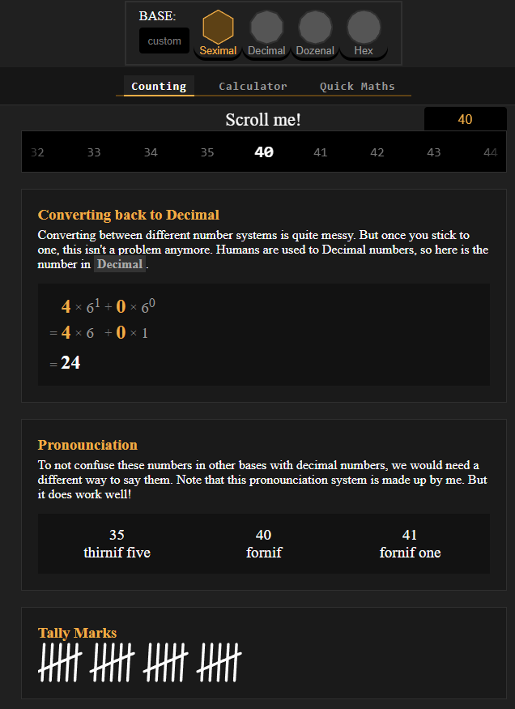
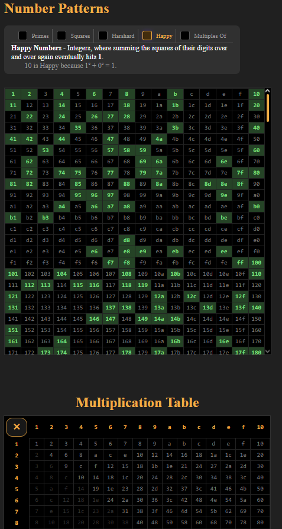
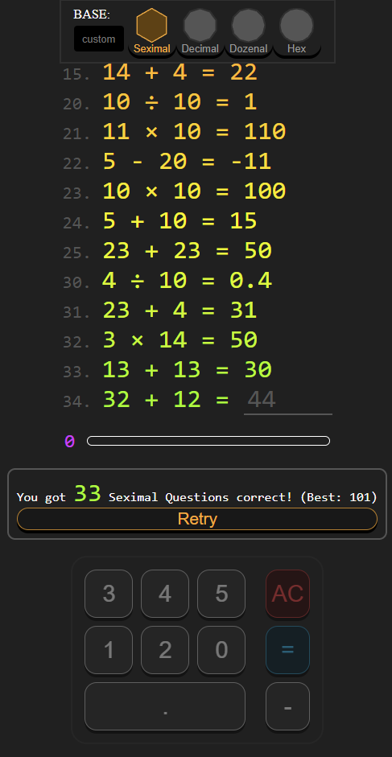

# Seximal

This is a website made for fun, that showcases what other number bases are like.
Meant to be explorable and fun by being really interactive. (this is super easy to do in Svelte <3)

# [Click to Visit!](https://redcatstone.github.io/seximal/)

# Calculator
This was originally the only thing i wanted to put on this page. Just a calculator that lets you switch base during calculations. It also has some cursed base dependent buttons like:
- %
- log (with the base current base)
- Sum (digit sum)
- Say (says the number)
- if you have more ideas, please shoot me a dm, thanks

# Counting
This tab is the first one at the top because its kind of meant to teach you how different number bases work. It has a scroller at the top that interacts with all the modules in the tab. includes:
- Converting back to Decimal
- Pronounciation
- Tally Marks
- Finger Counting
- Divisibility Rules
- Number Patterns table
- Multiplication table (and other arithmetic tables, press the button ;p)
- Base Divisibility (shows how divisible the base is)

# Quick Maths
Now this tab is really cool.
Me personally I've always wanted to see how intuitive other number bases actually are. And if you could actually get good at e.g. Seximal maths. Turns out, you very much so can.
It has a 30 second (18 in decimal) timer, and you get some time back if you answer correctly.

If you reach 100 (36 in decimal) questions in seximal, I shall call you a true seximalist. I got a few scores over 100 already ;p

And honestly, different base math is MUCH easier than you might think it is.
Here are a few Seximal examples:
- 3 × 10 = 20
- 3 × 2 = 10
- 3 × 4 = 20
- 11 × 11 = 121
- 12 × 12 = 144 (yes this works in seximal aswell)
- 5 + 24 = 33 (seximal 5 acts like a decimal 9)
- 13 × 4 = 100 (seximal 13 is the decimal 25)
- 4 / 10 = 0.4
- 5 / 10 = 0.5 (these work in any base)
- 25 - 13 = 12

# Credits
Inspiration from https://www.seximal.net <3

This project did use AI for some ideas and specific problems, but the Visuals and the core logic was all made by me!

# License
Licensed under the **MIT License**